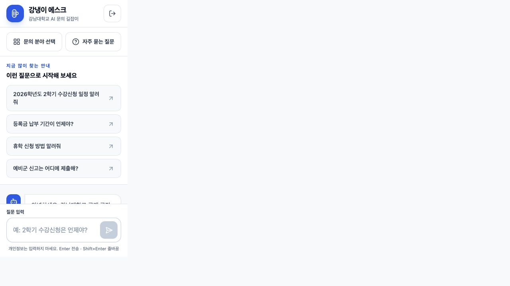
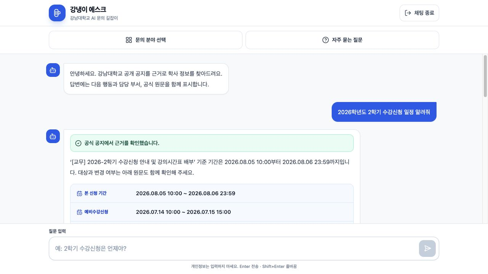
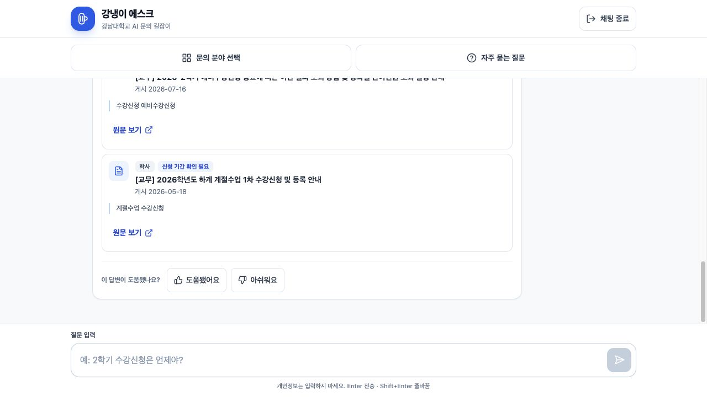

# 강냉이 에스크

강남대학교 학생이 학교 공지에 근거해 학사 질문을 하고, 신청 순서·담당 부서·원문까지 확인할 수 있는 AI 문의 챗봇 MVP입니다. 공지는 처음 들어오거나 내용이 바뀌었을 때만 구조화·임베딩하며, 저장된 신청 가이드는 질문마다 다시 생성하지 않고 그대로 재사용합니다.

> 이 프로젝트는 강남대학교 공식 서비스가 아닌 프로토타입입니다. 샘플 모드의 전화번호와 일부 공지 URL은 시연용 더미 데이터입니다.

전체 수집 필드와 품질 기준은 [수집·구조화 데이터 사전](docs/data_dictionary.md)을 기준으로 합니다.

## 화면

| 첫 화면 | 답변 및 출처 | 신청 절차 |
|---|---|---|
|  |  |  |

## 주요 기능

- 한국어 채팅, 문의 분야 7종, FAQ, 문의 종료 확인 모달
- 공지 기반 답변, 담당 부서·전화번호·운영시간, 원문 링크
- 공지에서 신청 대상·기간·준비물·1–2–3 단계·신청 링크를 추출한 액션 가이드
- 최근 12개월 공지·행사안내와 학사안내 전체·공식 FAQ·담당자 디렉터리 수집
- PDF/스캔 PDF/본문 이미지 한국어 OCR, HWPX·Office XML 텍스트 추출과 파일 해시 캐시
- 정규화 본문의 SHA-256 변경 감지와 변경 공지만 재처리
- 개발 환경 Codex 비전 구조화, 운영 환경 OpenAI Responses API 구조화, 로컬 BGE-M3 임베딩
- 핵심 고정 필드와 `additionalFacts` 확장 사실, 원문 HTML·이미지·OCR의 3층 보존
- 문서 청크, 출처 신뢰도, PostgreSQL 메타데이터와 pgvector를 결합한 하이브리드 랭킹
- 매시간 증분 크롤링 스케줄러와 단계별 진행 상태
- API 키 없이 실행하는 `MOCK_AI=true`, 사이트 없이 실행하는 `MOCK_CRAWLER=true`

## 기술 스택

- Frontend: React 18, TypeScript, Tailwind CSS, Vite
- Backend: FastAPI, Python 3.12, SQLAlchemy, Pydantic
- Data: PostgreSQL 16, pgvector
- AI: Gemini/OpenAI/Ollama(질문 분석·답변), Codex CLI(개발용 구조화), OpenAI Responses API(운영용 구조화), Ollama BGE-M3(임베딩)
- Runtime: Docker Compose, Nginx
- Test: pytest, Vitest, Testing Library

## 폴더 구조

```text
.
├── backend/
│   ├── app/
│   │   ├── api/             # REST API
│   │   ├── core/            # 환경설정
│   │   ├── data/            # 공지 5개·부서 4개·FAQ 샘플
│   │   ├── db/              # 초기화와 시드
│   │   ├── models/          # PostgreSQL/pgvector 모델
│   │   ├── prompts/         # 구조화·질문 분석·답변 프롬프트
│   │   ├── repositories/
│   │   └── services/        # AI, 검색, 크롤러, 변경 감지
│   ├── migrations/
│   └── tests/
├── frontend/
│   ├── src/components/
│   ├── src/pages/
│   └── src/test/
├── docs/                     # 기획서, 아키텍처 기록, 데이터 사전
├── scripts/                  # Codex 구조화 워커와 운영 보조 스크립트
├── design-system/            # UI 디자인 원칙과 토큰
├── nginx/
├── crawler/                 # 기존 단독 실행형 실사이트 수집 도구
├── docker-compose.yml
└── .env.example
```

## 가장 빠른 실행 방법

Docker Desktop 또는 Docker Engine/Compose가 필요합니다.

```bash
cp .env.example .env
docker compose up -d --build
```

브라우저에서 `http://localhost:8080`을 엽니다. 기본 설정은 샘플 크롤러를 사용하며, AI 키가 없거나 지정한 공급자를 사용할 수 없으면 규칙 기반 응답으로 안전하게 폴백합니다.

상태 확인과 종료:

```bash
curl http://localhost:8080/api/health
docker compose ps
docker compose down
```

DB 볼륨까지 지울 때만 `docker compose down -v`를 사용하세요. 이 명령은 저장된 PostgreSQL 데이터를 삭제합니다.

## 환경변수

`.env.example`을 `.env`로 복사한 뒤 값을 조정합니다.

| 변수 | 기본값 | 설명 |
|---|---|---|
| `DATABASE_URL` | Compose용 PostgreSQL URL | SQLAlchemy 연결 문자열 |
| `MOCK_AI` | `false` | `true`이면 외부 AI 대신 결정적 규칙 기반 응답 사용 |
| `MOCK_CRAWLER` | `true` | 샘플 공지 5개 사용 |
| `CHAT_PROVIDER` | `gemini` | `gemini`, `openai`, `ollama`, `auto`, `rules` 중 선택 |
| `GEMINI_API_KEY` | 비어 있음 | `CHAT_PROVIDER=gemini`일 때 사용 |
| `GEMINI_CHAT_MODEL` | `gemini-3.1-flash-lite` | Gemini 답변 모델 |
| `OPENAI_API_KEY` | 비어 있음 | `MOCK_AI=false`일 때 필수 |
| `OPENAI_CHAT_MODEL` | `gpt-4.1-mini` | 구조화·질문 분석·답변 모델 |
| `NOTICE_STRUCTURING_PROVIDER` | `rules` | `codex`(개발 Mac), `openai`(학교 운영), `rules`(테스트) |
| `OPENAI_ENRICHMENT_MODEL` | `gpt-5.6-sol` | 운영용 멀티모달 공지 구조화 모델 |
| `OPENAI_ENRICHMENT_REASONING_EFFORT` | `medium` | 운영용 구조화 추론 강도 |
| `OPENAI_IMAGE_DETAIL` | `original` | 이미지 공지의 글자·표 인식을 위한 상세도 |
| `OPENAI_EMBEDDING_MODEL` | `text-embedding-3-small` | 임베딩 모델 |
| `EMBEDDING_PROVIDER` | `auto` | OpenAI 키가 있으면 OpenAI, 아니면 호스트 Ollama, 둘 다 없으면 어휘 폴백 |
| `OLLAMA_EMBEDDING_MODEL` | `bge-m3` | Mac에서 실행하는 한국어 지원 로컬 의미 임베딩 모델 |
| `NOTICE_BASE_URL` | 강남대 웹 주소 | 상대 링크 기준 URL |
| `NOTICE_LIST_URL` | 공지 목록 URL | 실사이트 수집 시작점 |
| `NOTICE_DETAIL_URL` | 공지 상세 URL | 실사이트 상세 요청 URL |
| `CRAWLER_MONTHS` | `12` | 공지사항·행사안내에서 수집할 최근 개월 수 |
| `CRAWLER_MAX_PAGES` | `200` | 목록 수집 안전 상한. 기간 경계 전에 도달하면 기존 공지를 보관 처리하지 않음 |
| `CRAWLER_DELAY_SECONDS` | `0.8` | 학교 서버 요청 간격 |
| `CRAWLER_INCREMENTAL_PAGES` | `10` | 매시간 확인할 공지·행사 최신 목록 페이지 수 |
| `CRAWLER_INCLUDE_EVENTS` | `true` | 최근 12개월 행사안내도 별도 저우선순위 출처로 수집 |
| `CRAWLER_EVENT_DETAIL_LIMIT` | `300` | 행사 중 신청형 상세 본문·첨부까지 읽을 최대 건수(나머지는 목록 요약 저장) |
| `CRAWLER_EXTRACT_ATTACHMENTS` | `true` | 첨부파일·본문 이미지 텍스트 추출 및 OCR |
| `CRAWLER_SCHEDULE_MINUTES` | `60` | 자동 증분 수집 주기 |
| `CRAWLER_FULL_SCHEDULE_HOUR` | `3` | 매일 전체 1년 범위를 다시 확인할 시각 |
| `ADMIN_API_TOKEN` | `local-dev-admin` | 크롤러·재처리 API 보호용 로컬 관리자 토큰 |

## 로컬 개발

Python 3.12와 Node.js 20 이상을 권장합니다. Docker 없이 백엔드를 띄우면 기본 SQLite를 사용할 수 있습니다.

```bash
python3.12 -m venv .venv
source .venv/bin/activate
pip install -r backend/requirements.txt

cd backend
DATABASE_URL=sqlite:///./knuask.db MOCK_AI=true MOCK_CRAWLER=true python -m app.db.init_db
DATABASE_URL=sqlite:///./knuask.db MOCK_AI=true MOCK_CRAWLER=true python -m app.db.seed
DATABASE_URL=sqlite:///./knuask.db MOCK_AI=true MOCK_CRAWLER=true uvicorn app.main:app --reload
```

다른 터미널에서 프런트엔드를 실행합니다.

```bash
cd frontend
npm install
npm run dev
```

개발 화면은 `http://localhost:5173`, API 문서는 `http://localhost:8000/docs`입니다.

## 데이터베이스 초기화와 샘플 데이터

PostgreSQL 컨테이너 최초 생성 시 `backend/migrations/001_init.sql`이 pgvector 확장을 활성화합니다. 백엔드 시작 명령이 SQLAlchemy 모델을 기준으로 테이블을 생성하고 샘플을 멱등 삽입합니다.

```bash
docker compose exec backend python -m app.db.init_db
docker compose exec backend python -m app.db.seed
```

스키마를 변경한 운영 환경에서는 자동 `create_all`에 의존하지 말고 Alembic 마이그레이션을 추가해야 합니다. 현재 MVP는 단일 초기 스키마를 전제로 합니다.

## 크롤러 실행

기본 샘플 크롤러를 비동기로 시작하고 상태를 확인합니다.

```bash
curl -X POST -H 'X-Admin-Token: local-dev-admin' http://localhost:8080/api/crawler/run
curl -H 'X-Admin-Token: local-dev-admin' http://localhost:8080/api/crawler/status
```

실사이트 연동은 `.env`에서 `MOCK_CRAWLER=false`로 바꿉니다. 강남대 공지, 행사안내, 학사안내, FAQ와 담당자 디렉터리의 현재 DOM을 각각 파싱하며 사이트 개편 시 `backend/app/services/crawler/knu.py`의 선택자를 조정해야 합니다.

수집 규칙은 다음과 같습니다.

1. 게시일 기준 최근 `CRAWLER_MONTHS`개월만 상세 페이지를 요청합니다.
2. 제목·본문·첨부파일 텍스트·게시일·첨부/본문 링크 목록을 정규화해 SHA-256을 계산합니다.
3. 새 공지와 변경 공지만 AI 구조화 큐에 넣고, 해시가 같은 공지는 AI 처리를 건너뜁니다.
4. AI가 날짜·담당자·절차·이미지/PDF 정보와 확장 사실을 구조화한 뒤 검증을 통과해야 공개 검색 인덱스를 교체합니다.
5. 정상 수집이 끝난 뒤 이번 수집 범위에서 사라진 공지는 삭제하지 않고 `is_archived=true`로 바꿉니다.

학생 행동이 필요한 공지는 `action_guides`와 `action_steps`에 공지당 한 세트로 저장됩니다. 각 단계에는 행동 종류, 설명, 원문 위치, 검증된 링크와 신뢰도를 보존합니다. 링크는 실제 공지 본문에서 수집한 HTTPS 주소와 정확히 일치할 때만 노출하므로 모델이 임의의 신청 주소를 만들 수 없습니다. 질문이 “어떻게/방법/절차” 유형이면 서버는 이 저장값을 그대로 응답하며 답변 생성 모델을 다시 호출하지 않습니다.

첨부파일 URL·파일명·추출 본문뿐 아니라 수집 당시 원문 HTML과 등록자 원천 메타데이터도 저장됩니다. PDF 텍스트를 우선 읽고 글자가 없는 스캔 PDF와 이미지에는 Tesseract 한국어 OCR을 적용합니다. HWPX와 DOCX/PPTX/XLSX는 내부 XML을 읽으며, 구형 바이너리 HWP처럼 안전하게 읽지 못한 파일은 `needs_review` 대상으로 남깁니다. 파일 URL별 해시 캐시를 Docker 볼륨에 유지하므로 같은 파일에는 OCR을 반복하지 않습니다.

구조화 스키마는 무한히 넓히지 않습니다. 기간·대상·연락처·신청 절차처럼 화면과 검색에서 반복 사용하는 값은 고정 필드로 저장하고, 처음 등장한 예외·제약·처리 규칙은 `additionalFacts` 배열에 종류·이름·값·적용 대상·근거 위치와 함께 보존합니다. 모든 정형화 정보가 빠져도 원문과 원문 청크는 그대로 남으므로 스키마를 확장한 뒤 재크롤링 없이 다시 구조화할 수 있습니다.

```bash
python3 -m pip install -r crawler/requirements.txt
python3 crawler/knu_crawler.py --months 12 --download-attachments
```

## AI 후처리 설정과 비용 제어

개발 Mac에서는 `NOTICE_STRUCTURING_PROVIDER=codex`를 사용합니다. 설치된 LaunchAgent가 30초마다 새 공지 큐를 확인하며, 저장된 Codex 로그인으로 이미지와 OCR을 함께 구조화합니다. Docker는 공지를 수집·저장하고 Mac 워커는 AI 결과만 반환하므로 Codex 로그인 정보를 서버에 노출하지 않습니다.

학교 운영 서버에서는 다음처럼 공급자만 바꾸고 OpenAI 워커를 실행합니다. 같은 Pydantic/JSON 스키마와 저장 검증기를 사용합니다.

```dotenv
MOCK_AI=false
OPENAI_API_KEY=sk-...
NOTICE_STRUCTURING_PROVIDER=openai
OPENAI_ENRICHMENT_MODEL=gpt-5.6-sol
OPENAI_ENRICHMENT_REASONING_EFFORT=medium
OPENAI_IMAGE_DETAIL=original
```

```bash
docker compose exec backend python -m app.workers.openai_ingestion --watch
```

비용을 줄이는 핵심은 공지마다 최초 1회만 구조화·임베딩하고, 신청 방법 질문에는 저장된 액션 가이드를 그대로 반환하는 것입니다. 일반 생성 답변이 필요한 경우에도 전체 공지가 아니라 검색 상위 최대 5개만 답변 모델에 전달합니다. 이미지 비전과 첨부 OCR은 파일 해시가 바뀐 경우에만 별도 비동기 작업으로 실행하는 것을 권장합니다.

API 토큰 없이 Mac의 의미 임베딩을 사용하려면 호스트에서 다음을 한 번 실행합니다. Docker 백엔드는 `host.docker.internal`을 통해 자동 감지합니다.

```bash
brew install ollama
brew services start ollama
ollama pull bge-m3
```

실제 사용한 임베딩 공급자와 모델은 `GET /api/health`의 `embeddingProvider`, `embeddingModel`에서 확인할 수 있습니다. 프롬프트·추출기·임베딩 모델이 바뀌면 계산된 파이프라인 버전이 달라져 다음 증분 수집에서 필요한 문서만 다시 인덱싱합니다.

## API

- `POST /api/chat`
- `DELETE /api/chat/sessions/{session_id}`
- `GET /api/categories`
- `GET /api/categories/{category}/notices`
- `GET /api/faqs`
- `GET /api/notices/search`
- `POST /api/feedback`
- `POST /api/crawler/run` (`X-Admin-Token` 필요)
- `GET /api/crawler/status` (`X-Admin-Token` 필요)
- `GET /api/notices/{notice_id}`
- `POST /api/notices/{notice_id}/reprocess` (`X-Admin-Token` 필요)
- `GET /api/health`

## 테스트

```bash
source .venv/bin/activate
pytest backend/tests -q

cd frontend
npm test
npm run build
```

현재 기준 백엔드 67개, 프런트엔드 7개 테스트를 포함합니다. 변경 감지, Codex/OpenAI 구조화 큐, 확장 사실, 액션 가이드 교체·링크 검증, 하이브리드 검색, 데이터 없음 응답, 개인정보 입력 차단, 관리자 API 보호, 피드백 저장, 크롤러 파서, API와 주요 UI 흐름을 검증합니다.

## 현재 MVP 제한사항과 실제 도입 순서

- 샘플 모드의 부서 전화번호는 가짜입니다. 실사이트 모드에서는 공식 직원 연락처를
  `staff_directory_contacts`에 별도 저장하고, 공지 원문에 번호가 없을 때만 부서명과
  업무명(예: `교무팀 + 수강신청`)으로 보완합니다. 이 값은 화면에서 공식 연락처 보완임을 표시합니다.
- 연락처만 즉시 갱신하려면 `docker compose exec -T backend python -m app.workers.staff_directory_sync`를 실행합니다.
- 실사이트 크롤러는 공개 HTML 구조에 의존합니다. 먼저 학교의 이용 정책과 robots.txt를 확인하고, 가능하면 내부 공지 API/DB 읽기 권한을 받는 편이 안정적이고 저렴합니다.
- 구형 바이너리 HWP는 자동 추출하지 못하므로 원문 확인 또는 별도 변환기가 필요합니다.
- 백그라운드 작업과 스케줄러는 현재 FastAPI 단일 프로세스 안에서 실행합니다. 다중 서버 운영에서는 Celery/RQ 같은 단일 워커로 분리해야 중복 실행을 확실히 막을 수 있습니다.
- 학생 인증·개인정보 시스템 연동·관리자 검수 화면·상담원 실시간 연결은 포함하지 않습니다. 공개 질의 입력의 학번·계좌번호 형식은 전송 전에 차단합니다.
- 답변은 원문 공지를 근거로 하지만, 사용자는 진행 여부와 마감을 원문에서 다시 확인해야 합니다.

실제 도입 시에는 내부 API/DB 조회 → 부서 디렉터리 연동 → 첨부파일 추출 워커 → 관리자 검수 화면 → 관측·알림 순으로 확장하는 구성이 안전합니다.

## 기존 첫 화면 시연본

저장소 루트의 `index.html`, `styles.css`, `script.js`는 강남대학교 첫 화면에 AI 기능을 배치한 별도 정적 시연본입니다.

```bash
python3 -m http.server 8090
```

`http://localhost:8090`에서 확인할 수 있습니다.
