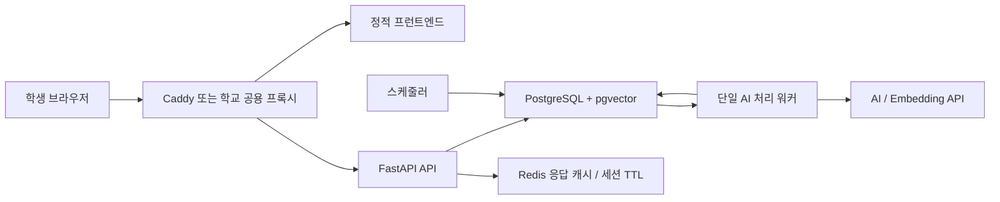

# 백엔드 및 인프라 후보 비교

- 문서 상태: 제안
- 작성일: 2026-07-20
- 대상: 강냉이 에스크 소규모 MVP와 이후 학교 서버 이전

## 1. 결론

초기 권장안은 **FastAPI + PostgreSQL/pgvector + Redis 캐시 + PostgreSQL 기반 작업 큐 + Docker Compose**이다. 외부에 직접 공개하는 동안에는 Caddy를 진입점으로 쓰고, 학교가 공용 Nginx·로드 밸런서·TLS 종단을 제공하면 그 계층을 그대로 사용한다.

핵심 판단은 다음과 같다.

1. 공지가 수천 건 이하이므로 PostgreSQL의 일반 인덱스, 전문 검색, pgvector만으로 메타데이터 필터와 벡터 검색을 한 트랜잭션 안에서 처리할 수 있다. 현재 규모에서는 Elasticsearch/OpenSearch나 별도 벡터 DB가 주는 이점보다 운영 대상 증가가 더 크다.
2. 학생 질문은 반복되므로 Redis 응답 캐시는 AI 호출 비용과 응답 시간을 직접 줄인다. 다만 Redis를 작업 큐로까지 확장할 필요는 아직 없다.
3. 공지 구조화·임베딩 작업은 공지 최초 수집 또는 본문 변경 시에만 발생한다. 작업량은 적지만 프로세스 재시작 때 유실되면 안 되므로, API 프로세스 내부의 단순 백그라운드 작업 대신 PostgreSQL 작업 테이블과 단일 워커를 둔다.
4. 애플리케이션과 데이터 계층을 컨테이너 및 표준 PostgreSQL 인터페이스로 유지하면 Mac mini에서 학교 Linux 서버로 옮길 때 이미지, Compose 설정, 볼륨 복구 절차를 재사용할 수 있다.
5. 질문 원문과 대화 기록은 영구 저장하지 않는다. 캐시·세션·로그에도 만료와 마스킹 정책을 적용한다.

권장 구성은 목표 상태이며, 현재 저장소의 `FastAPI + PostgreSQL/pgvector + Redis + Nginx + Docker Compose`와 대부분 일치한다. 우선 변경할 부분은 프록시 교체가 아니라 **프로세스 내부 크롤러 작업을 내구성 있는 작업 큐/워커로 분리하는 것**이다.

## 2. 전제와 평가 기준

### 전제

- 활성 공지와 보관 공지를 합쳐도 초기에는 수천 건 이하이다.
- 읽기와 질문 요청이 대부분이고, 공지 쓰기·AI 재처리는 드물다.
- 동일하거나 의미가 비슷한 질문이 반복된다.
- 개인정보, 질문 원문, 전체 대화는 장기 보관 대상이 아니다.
- 공지는 정규화한 본문의 해시가 새롭거나 변경된 경우에만 구조화·임베딩한다.
- 초기 운영자는 소수이며 24시간 상주 운영을 전제로 하지 않는다.
- 향후 학교 내부 Linux 서버 또는 학교가 제공하는 VM으로 이전할 수 있어야 한다.

### 평가 가중치

| 기준 | 가중치 | 판단 내용 |
|---|---:|---|
| MVP 단순성 | 25% | 개발 속도, 기존 코드 재사용, 구성 요소 수 |
| 운영 부담 | 25% | 장애 지점, 패치·모니터링·백업 대상 수 |
| 학교 서버 이전성 | 20% | 특정 클라우드 종속성, 컨테이너 이동성, 데이터 내보내기 |
| 현재 규모 적합성 | 15% | 수천 건 검색, 반복 질문, 저빈도 AI 작업 |
| 초기 비용 | 10% | 고정 인프라와 관리형 서비스 비용 |
| 대규모 확장성 | 5% | 데이터·트래픽이 크게 늘 때의 확장 여지 |

## 3. 인프라 후보

### 후보 A — 경량·이전 가능형 (권장)



| 영역 | 선택 |
|---|---|
| 데이터베이스 | PostgreSQL + pgvector 단일 DB |
| 백엔드 | 기존 FastAPI 유지 |
| 배포 | 초기 Mac mini Docker Compose → 학교 내부 서버 Compose |
| 프록시 | 외부 직접 공개 시 Caddy, 학교 진입 계층이 있으면 학교 Nginx/LB |
| 캐시 | Redis 응답 캐시와 단기 세션만 사용 |
| 작업 처리 | PostgreSQL 작업 테이블 + 단일 워커 |

장점은 현재 코드 변경이 작고, 검색·원문·처리 상태·작업 상태를 PostgreSQL 백업 하나로 복구할 수 있다는 점이다. Redis는 재생성 가능한 캐시이므로 백업 필수 대상이 아니다. 단점은 데이터가 수백만 청크로 늘거나 복잡한 한국어 전문 검색이 핵심 기능이 되면 검색 계층을 다시 평가해야 한다는 점이다.

### 후보 B — 학교 표준 Java형

| 영역 | 선택 |
|---|---|
| 데이터베이스 | PostgreSQL + pgvector |
| 백엔드 | Spring Boot |
| 배포 | 학교 내부 서버 또는 학교 표준 VM |
| 프록시 | 학교 공용 Nginx/LB |
| 캐시 | 초기 미사용 또는 학교 공용 Redis |
| 작업 처리 | PostgreSQL 작업 큐 + Spring 스케줄러/별도 워커 |

학교 전산 조직이 Java, Spring, 중앙 모니터링, 공용 PostgreSQL을 표준으로 운영할 때 유효하다. 장기 인수인계와 내부 인증 연동에서는 이점이 있을 수 있다. 반면 현재 Python AI·크롤링 코드를 다시 작성하거나 별도 Python 워커로 남겨야 하므로 MVP 단계에서는 이중 런타임 또는 재개발 비용이 발생한다. **학교 측 표준이 확인되기 전에는 선택하지 않는다.**

### 후보 C — 별도 벡터 검색 확장형

| 영역 | 선택 |
|---|---|
| 데이터베이스 | PostgreSQL(원본·메타데이터) + 별도 벡터 DB |
| 백엔드 | FastAPI |
| 배포 | 퍼블릭 클라우드 또는 자원이 충분한 학교 서버 |
| 프록시 | Nginx 또는 클라우드 로드 밸런서 |
| 캐시 | Redis 캐시 |
| 작업 처리 | Redis + Celery/RQ |

PostgreSQL을 기준 데이터(source of truth)로 유지하고, 벡터 DB에는 `notice_id`, 청크, 임베딩, 검색용 필터의 사본만 저장한다. 대량 벡터 검색과 검색 전용 수평 확장에는 유리하지만 이중 쓰기, 재색인, 정합성 검사, 백업 대상이 추가된다. 별도 벡터 DB만을 주 데이터베이스로 쓰는 방식은 공지 상태·부서·첨부·처리 이력을 관계형으로 관리해야 하는 이 서비스에 맞지 않는다.

도입 조건은 임의의 미래 예상이 아니라 측정값으로 정한다. 예를 들어 청크가 수십만~수백만 개로 증가하고, 목표 지연 시간을 pgvector가 지속적으로 넘거나, 검색 노드만 독립 확장할 필요가 생겼을 때 부하 시험 후 검토한다.

### 후보 D — 전문 검색 클러스터형

| 영역 | 선택 |
|---|---|
| 데이터베이스 | PostgreSQL + OpenSearch(또는 OpenSearch 단독 인덱스) |
| 백엔드 | FastAPI 또는 Spring Boot |
| 배포 | 퍼블릭 클라우드 관리형 서비스 또는 학교 검색 클러스터 |
| 프록시 | Nginx/클라우드 로드 밸런서 |
| 캐시 | Redis 캐시 |
| 작업 처리 | Redis + Celery/RQ |

형태소 분석, 동의어 사전, 강조 표시, 전문 검색과 벡터 점수를 결합한 검색 품질 튜닝이 제품의 핵심이 될 때 적합하다. OpenSearch는 키워드와 신경망 검색 결과를 결합하는 하이브리드 검색 파이프라인을 제공한다. 그러나 JVM 검색 클러스터의 메모리, 인덱스 매핑, 샤드, 스냅샷, 재색인을 별도로 운영해야 하므로 수천 건 MVP에는 과도하다. PostgreSQL과 함께 쓰면 후보 C와 마찬가지로 이중 쓰기 정합성도 관리해야 한다.

### 후보 E — 클라우드 서버리스형

| 영역 | 선택 |
|---|---|
| 데이터베이스 | Firebase Firestore 벡터 검색 |
| 백엔드 | Node.js/NestJS 또는 서버리스 함수에 맞춘 경량 Node.js |
| 배포 | 서버리스/관리형 컨테이너 |
| 프록시 | 직접 제공(API Gateway/플랫폼 라우팅) |
| 캐시 | 초기 미사용 또는 관리형 Redis |
| 작업 처리 | 관리형 작업 큐/이벤트 트리거 |

서버 패치와 단일 장비 장애를 플랫폼에 맡길 수 있고 초기 트래픽이 매우 적으면 사용량 기반 비용이 유리할 수 있다. Firestore도 벡터 필드와 KNN 검색을 제공하지만 임베딩 생성은 별도 서비스가 담당해야 하며, 벡터 인덱스 스캔도 읽기 과금 대상이다. 관계형 필터·조인 중심 모델을 문서 모델로 바꾸고 학교 서버 이전 시 데이터를 PostgreSQL로 다시 이관해야 하므로 본 요구의 이전성에는 가장 불리하다. 서버리스 함수의 실행 시간, 동시성, 콜드 스타트에 맞춰 크롤러와 AI 처리를 재설계해야 하는 점도 고려해야 한다.

### 후보 종합 점수

5점이 가장 유리하다. 점수는 위 전제에서의 상대 평가이며 실제 학교 표준과 견적이 확인되면 갱신한다.

| 후보 | MVP 단순성 25% | 운영 부담 25% | 이전성 20% | 규모 적합성 15% | 비용 10% | 확장성 5% | 가중 합계 |
|---|---:|---:|---:|---:|---:|---:|---:|
| A. 경량·이전 가능형 | 5 | 5 | 5 | 5 | 4 | 3 | **4.80** |
| B. 학교 표준 Java형 | 2 | 3 | 5 | 4 | 3 | 4 | **3.35** |
| C. 별도 벡터 검색형 | 2 | 2 | 3 | 2 | 2 | 5 | **2.35** |
| D. 전문 검색 클러스터형 | 2 | 1 | 3 | 2 | 1 | 5 | **2.00** |
| E. 클라우드 서버리스형 | 4 | 4 | 1 | 3 | 4 | 4 | **3.25** |

## 4. 구성 요소별 비교

### 4.1 데이터베이스와 검색

| 선택지 | 현재 적합도 | 장점 | 단점과 운영 부담 | 판단 |
|---|---|---|---|---|
| PostgreSQL + pgvector | **매우 높음** | 원문·메타데이터·벡터의 트랜잭션 일관성, SQL 필터·조인, 백업 1종, 정확/근사 검색 지원 | 초대규모 검색 전용 수평 확장은 별도 설계 필요 | **초기 채택** |
| Elasticsearch/OpenSearch | 낮음 | 강력한 전문 검색, 분석기·동의어·하이라이트, 키워드+벡터 하이브리드 검색 | 검색 클러스터, JVM 메모리, 샤드·스냅샷·재색인 운영; 원본 DB와 정합성 필요 | 검색 품질 요구가 검증된 뒤 |
| Firebase Firestore | 보통 | 관리형 운영, 실시간 SDK, 벡터 KNN 지원 | 문서형 재설계, 조인 제약, 읽기/벡터 인덱스 과금, 학교 서버 이전 비용 | 서버리스 우선일 때만 |
| 별도 벡터 DB 단독 | 낮음 | 벡터 검색 기능과 확장에 집중 | 관계형 원본·처리 이력·작업 큐에 부적합, 제품 종속 API | 주 DB로 사용하지 않음 |
| PostgreSQL + 별도 벡터 DB | 현재 낮음, 미래 보통 | PostgreSQL의 정합성과 검색 전용 확장을 분리 | 이중 쓰기·삭제·재색인·백업·관측 복잡도 | 측정된 병목이 있을 때 |

pgvector는 정확 검색과 HNSW/IVFFlat 근사 검색, 메타데이터 `WHERE` 필터, PostgreSQL 전문 검색과 결합한 하이브리드 검색을 지원한다. 수천 건에서는 먼저 **정확 검색**으로 단순하게 운영하고, `EXPLAIN ANALYZE`로 병목이 확인될 때 HNSW를 추가하는 편이 결과 재현성과 운영 면에서 유리하다. 임베딩 차원과 모델 버전을 컬럼/메타데이터로 고정하고 모델 변경 시 새 버전을 병행 생성한 뒤 전환한다.

### 4.2 백엔드

| 선택지 | 장점 | 단점 | 이 서비스의 판단 |
|---|---|---|---|
| FastAPI | 기존 코드 재사용, Python 크롤링·AI 생태계와 같은 런타임, 타입 기반 API 스키마 | CPU/장시간 작업은 API 프로세스와 분리 필요 | **유지** |
| Spring Boot | 학교 조직의 Java 표준, 성숙한 보안·운영·관측 생태계, 장기 유지보수 인력 확보 가능성 | 현재 구현 재작성, AI/크롤러 Python과 이중 런타임 가능성, MVP 자원 사용량 증가 | 학교 표준이 명시될 때 선택 |
| Node.js/NestJS | TypeScript로 프런트·백엔드 언어 통일, 모듈/DI 구조, I/O 중심 API에 적합 | 현재 Python 재작성, Python 기반 문서 처리 도구와 경계 발생 | 팀의 주력 언어가 TypeScript일 때 대안 |

프레임워크의 이론적 성능보다 기존 구현, 운영팀 숙련도, 크롤러·AI 처리 코드의 재사용이 더 중요한 규모다. 현재는 FastAPI가 가장 낮은 위험이다. FastAPI 공식 문서도 무거운 백그라운드 계산은 다중 프로세스/서버 작업 도구로 분리하고, 작은 작업만 프로세스 내부 `BackgroundTasks`로 처리하도록 구분한다.

### 4.3 배포 위치

| 선택지 | 장점 | 위험/제약 | 권장 용도 |
|---|---|---|---|
| Mac mini Docker Compose | 이미 보유 시 저비용, 빠른 MVP, 전체 구성을 한 파일로 재현 | 단일 장비·전원·회선 장애, macOS/Docker Desktop 업데이트, 원격 복구, 공인 TLS·방화벽 책임 | 제한된 시범 운영; 자동 재시작·외부 백업·UPS 필요 |
| 학교 내부 서버 | 데이터 경로와 정책 통제, 내부 인증/공지 연계, 장기 이전 목표에 부합 | 자원 신청, 방화벽·DNS·TLS·패치 책임 경계 확인 필요 | **정식 운영 우선 후보** |
| 퍼블릭 클라우드 | 관리형 DB/백업/관측, 빠른 확장, 가용 영역 선택 | 지속 비용, 반출·보안 심사, 관리형 서비스 종속 가능성 | 학교 서버 준비 전 또는 가용성 요구가 높을 때 |
| 서버리스 | 서버 패치 최소화, 사용량 기반 확장 | 콜드 스타트, 실행 한도, 장기 작업 재설계, 로컬/학교 이전성 저하 | 짧고 무상태인 API에 한정 |

Mac mini는 개발 장비와 운영 장비를 분리하고, 절전·자동 로그아웃·자동 OS 업데이트로 서비스가 중단되지 않게 설정해야 한다. 데이터베이스 포트는 외부에 공개하지 않고 프록시의 80/443만 허용한다. 운영 공개 범위가 전교 대상이고 장애 허용 시간이 짧다면 학교 서버나 클라우드를 먼저 선택한다.

### 4.4 프록시

| 선택지 | 장점 | 단점 | 판단 |
|---|---|---|---|
| Nginx | 널리 사용, 세밀한 정적 파일·프록시·제한 설정, 학교 표준일 가능성 | 공개 TLS 인증서 자동화에 별도 도구/절차가 필요할 수 있음 | 학교 공용 진입 계층 또는 현 구성 유지 |
| Caddy | 설정이 작고 공개 도메인의 인증서 발급·갱신과 HTTP→HTTPS를 자동화 | 조직 표준/운영 경험이 Nginx에 집중되어 있으면 인수인계 비용 | 소수 인력이 직접 공개 서버를 운영할 때 권장 |
| 프록시 없이 직접 제공 | 구성 요소 하나 감소 | TLS 종단, 정적 파일, 요청 크기/속도 제한, 보안 헤더, API 라우팅을 앱/플랫폼이 모두 담당 | 로컬 개발 또는 플랫폼 게이트웨이가 대신할 때만 |

프록시는 제품 기능보다 배포 환경의 책임 경계로 결정한다. 학교가 TLS와 외부 접근을 종단하면 앱 Compose에 별도 공개 프록시를 중복 배치하지 않아도 된다. 반대로 단일 장비가 인터넷에 직접 노출되면 프록시 없는 제공은 피한다.

### 4.5 캐시와 작업 처리

| 선택지 | 장점 | 단점 | 판단 |
|---|---|---|---|
| Redis 미사용 | 서비스 수와 메모리 최소화 | 반복 질문마다 임베딩·생성 비용 발생, 세션 TTL을 앱 메모리에 두면 다중 인스턴스 불일치 | 트래픽이 거의 없는 내부 데모만 |
| Redis 캐시 | 반복 질문 응답 시간·AI 비용 절감, TTL 처리 단순 | Redis 장애/메모리 정책 관리, 질문에 개인정보가 섞일 수 있음 | **응답 캐시와 단기 세션에 채택** |
| Redis + Celery/RQ | 재시도, 워커 분리, 수평 확장, 예약/상태 도구 | 브로커·워커·실패 큐 운영과 중복 실행 처리 필요 | 작업량/동시성이 증가할 때 |
| DB 기반 작업 큐 | 추가 데이터 서비스 없이 내구성·트랜잭션·상태 조회 확보 | 폴링 부하, 우선순위/스케줄/관측 기능을 직접 구현 | **저빈도 AI 처리에 채택** |

권장 작업 큐는 `notice_processing_jobs` 같은 테이블에 `notice_id`, `content_hash`, `processing_version`, `status`, `attempts`, `available_at`, `locked_at`, `last_error`를 둔다. 워커는 `FOR UPDATE SKIP LOCKED`로 작업을 가져가며 `(notice_id, content_hash, processing_version)` 고유 제약으로 중복 등록을 막는다. AI 호출은 본질적으로 재시도될 수 있으므로 결과 저장도 멱등하게 만든다. 지수 백오프와 최대 시도 횟수 이후 `dead` 상태를 두고 운영자에게 알린다.

Redis 캐시 키는 정규화 질문 원문을 그대로 쓰지 않고 다음 요소의 해시로 만든다.

```text
SHA-256(normalized_question + retrieval_version + answer_model + notice_corpus_version)
```

이렇게 하면 공지가 변경되거나 검색/모델 버전이 바뀔 때 오래된 답을 재사용하지 않는다. 엄밀한 의미 유사 질문까지 합치려면 별도 의미 캐시가 필요하지만, MVP에서는 오답 재사용 위험이 낮은 정규화 동일 질문 캐시부터 적용한다.

## 5. 권장안 상세 운영 설계

### 컨테이너 경계

- `proxy`: Caddy 또는 Nginx. 80/443만 호스트에 공개한다.
- `frontend`: 정적 빌드 결과. 프록시가 직접 제공하거나 전용 경량 웹 서버가 제공한다.
- `api`: FastAPI. 무상태로 유지하며 크롤링·AI 장기 작업을 직접 실행하지 않는다.
- `worker`: API와 같은 애플리케이션 이미지를 사용하되 작업 소비 명령만 다르게 실행한다.
- `scheduler`: 주기적으로 공지 수집 작업을 등록한다. 초기에는 단일 프로세스/cron이면 충분하다.
- `postgres`: 공지, 메타데이터, 임베딩, 처리 버전, 작업 상태의 기준 데이터이다.
- `redis`: 재생성 가능한 답변 캐시와 단기 세션만 둔다.

### 가용성과 복구

- PostgreSQL은 매일 논리 백업 또는 물리 백업을 암호화해 **운영 장비 밖**에 보관한다. 정기적으로 빈 DB에 복원 시험을 한다.
- Redis는 캐시로 취급한다. 장애 시 캐시 미스로 우회하고, Redis 데이터 복구를 서비스 복구의 선행 조건으로 두지 않는다.
- 이미지 태그와 마이그레이션 버전을 고정한다. 배포 전에 DB 백업 후 마이그레이션하고, 이전 앱 이미지로 되돌릴 수 있게 한다.
- `/health/live`와 `/health/ready`를 분리한다. 준비 상태는 PostgreSQL 연결을 확인하되 외부 AI API 장애가 API 전체를 비정상으로 만들지는 않게 한다.
- 최소 알림은 디스크 사용량, PostgreSQL 백업 실패, 연속 크롤링 실패, `dead` 작업 존재, API 5xx 증가를 대상으로 한다.

### 개인정보와 로그

- 질문 원문과 전체 대화는 PostgreSQL에 저장하지 않는다.
- 세션은 불투명한 임의 ID만 사용하고 Redis TTL을 1시간 이하로 둔다.
- 답변 캐시는 6~24시간 TTL로 제한한다. 캐시 키는 질문 해시만 사용하며 키 목록만으로 원문을 복원할 수 없게 한다.
- 애플리케이션·프록시 접근 로그에 요청 본문, Authorization 헤더, 쿠키, 전체 쿼리 문자열을 남기지 않는다.
- 오류 추적 도구로 보내기 전에 전화번호, 학번, 이메일 등 식별 가능 문자열을 마스킹한다.
- 운영 지표는 질문 원문 대신 지연 시간, 캐시 적중 여부, 카테고리, 익명 집계 건수만 남긴다.

## 6. 단계별 도입과 전환 조건

### 0단계 — 현재 MVP 보강

1. PostgreSQL/pgvector와 Redis를 유지한다.
2. 인프로세스 `BackgroundTasks` 크롤러를 PostgreSQL 작업 테이블과 별도 워커로 옮긴다.
3. 질문 캐시 키에 공지 코퍼스/처리/모델 버전을 포함한다.
4. 요청 본문 비로그, TTL, 마스킹 정책을 적용한다.
5. PostgreSQL 외부 백업과 복원 시험, 디스크·작업 실패 알림을 추가한다.

### 1단계 — 학교 서버 이전 준비

1. 학교 측 CPU/메모리/디스크, Linux 배포판, Docker 허용 여부를 확인한다.
2. DNS, TLS 종단, 방화벽, 외부 AI API 송신 허용, 비밀 관리의 담당 주체를 문서화한다.
3. 아키텍처별 설정 차이를 환경변수와 Compose override로만 관리한다.
4. 스테이징에서 PostgreSQL 백업을 복원하고 검색 결과 수, 임베딩 차원/모델 버전, 작업 상태를 검증한다.
5. DNS 전환 전 짧은 쓰기 중지 → 최종 백업/복원 → 상태 점검 → 전환 순서로 이전한다.

### 확장 재평가 트리거

아래 조건 중 하나가 지속적으로 관측될 때만 복잡한 후보를 검토한다.

- pgvector 검색 p95가 목표치를 넘고 SQL/인덱스 튜닝과 수직 확장으로 해결되지 않는다.
- 공지 첨부 청크가 수십만~수백만 단위로 늘어 검색 전용 노드의 독립 확장이 필요하다.
- 한국어 분석기, 동의어, 오탈자, 강조 표시 등 전문 검색 요구가 제품 핵심이 된다.
- AI 처리 대기열이 단일 워커 처리량을 지속적으로 초과하거나 우선순위·예약·복잡한 재시도가 필요하다.
- 다중 API 인스턴스와 높은 캐시 가용성 요구로 관리형 PostgreSQL/Redis가 운영 비용보다 유리해진다.

이때 후보 C/D와 Celery/RQ를 작은 데이터 복제본으로 부하 시험하고, 검색 품질·p95·월 비용·복구 시간을 후보 A와 비교한 뒤 결정한다.

## 7. 최종 의사결정 표

| 의사결정 | 초기 선택 | 보류/대안 | 변경 조건 |
|---|---|---|---|
| 기준 DB | PostgreSQL + pgvector | OpenSearch, 별도 벡터 DB, Firestore | 측정된 검색 병목 또는 플랫폼 우선 전략 |
| API | FastAPI | Spring Boot, NestJS | 학교 표준 또는 운영팀 주력 언어 확정 |
| 초기 배포 | Mac mini Compose(제한된 MVP) | 퍼블릭 클라우드 | 가용성·보안 요구가 단일 장비 범위를 초과 |
| 목표 배포 | 학교 서버 Compose/동등 컨테이너 환경 | 관리형 클라우드 | 학교 자원·외부 송신 정책 부적합 |
| 프록시 | Caddy 또는 학교 공용 Nginx | 직접 제공 | 플랫폼 게이트웨이가 모든 역할을 대체할 때만 |
| 응답 캐시 | Redis | 미사용 | 반복률·AI 비용이 실제로 무시 가능한 경우 |
| AI 작업 | PostgreSQL 큐 + 단일 워커 | Redis + Celery/RQ | 대기열·동시성·재시도 요구 증가 |

## 8. 근거 자료

- [pgvector 공식 저장소](https://github.com/pgvector/pgvector): 정확/근사 최근접 검색, HNSW·IVFFlat, SQL 필터와 PostgreSQL 전문 검색 결합
- [OpenSearch 하이브리드 검색 공식 문서](https://docs.opensearch.org/latest/vector-search/ai-search/hybrid-search/index/): 키워드와 신경망 검색 점수 결합
- [Cloud Firestore 벡터 검색 공식 문서](https://firebase.google.com/docs/firestore/vector-search): 벡터 저장·인덱스·KNN 검색과 외부 임베딩 생성
- [Cloud Firestore 과금 공식 문서](https://firebase.google.com/docs/firestore/pricing): KNN 벡터 인덱스 읽기 과금 방식
- [FastAPI Background Tasks 공식 문서](https://fastapi.tiangolo.com/tutorial/background-tasks/): 작은 인프로세스 작업과 Celery 같은 외부 작업 도구의 구분
- [Celery Redis 공식 문서](https://docs.celeryq.dev/en/stable/getting-started/backends-and-brokers/redis.html): Redis 브로커, 재전달과 visibility timeout 주의점
- [Spring Boot 시스템 요구사항 공식 문서](https://docs.spring.io/spring-boot/system-requirements.html): Java 런타임과 서블릿 컨테이너 지원
- [Caddy Automatic HTTPS 공식 문서](https://caddyserver.com/docs/automatic-https): 인증서 발급·갱신과 HTTP→HTTPS 자동화
- [Docker Compose 공식 문서](https://docs.docker.com/compose/): 다중 컨테이너 애플리케이션 정의와 실행
