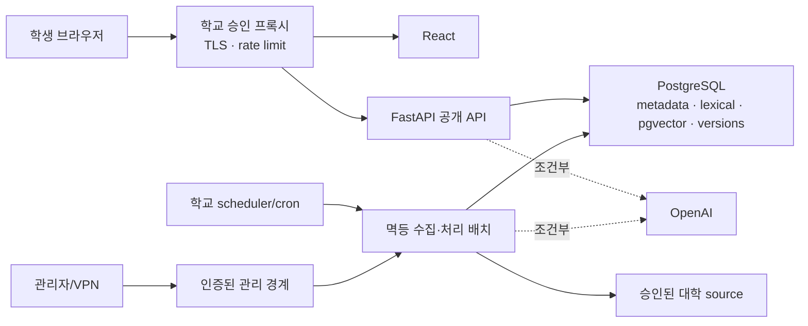

# KNU-Ask 최종 아키텍처 결정

- 결정일: 2026-07-20
- 결정 상태: MVP 기준안
- 최종 선택: **후보 A — React + FastAPI + PostgreSQL + pgvector + OpenAI**
- 적용 조건: OpenAI는 조건부 호출, Redis·Elasticsearch·별도 Vector DB는 MVP에서 제외

## 1. 조사 요약

국내·해외 대학 사례, 현재 저장소 코드, RAG·인프라 후보, UX 권고, 보안·비판 리뷰를 통합했다. 자세한 근거는 다음 문서에 있다.

- [국내 사례 조사](../research/korea-university-chatbots.md)
- [해외 사례 조사](../research/global-university-chatbots.md)
- [RAG 후보](../architecture/rag-options.md)
- [인프라 후보](../architecture/infrastructure-options.md)
- [RAG 대 인프라 토론](../debate/rag-vs-infrastructure.md)
- [UX 실현 가능성](../debate/ux-feasibility.md)
- [위험 도전](../debate/risk-challenges.md)
- [비판 답변](../debate/responses.md)

조사의 결론은 생성 모델의 유창함보다 공식 데이터의 범위·최신성·근거, 다음 행동, 실패 시 사람/원문 연결, 운영 책임이 서비스 성패를 좌우한다는 것이다. 현재 공지 수천 건 규모와 Python 기반 구현에서는 검색 시스템을 여러 개 운영하는 것보다 PostgreSQL 하나에서 메타데이터·lexical 검색·벡터를 검증하는 편이 적합하다.

## 2. 국내 대학 챗봇의 공통 특징

- 공개 홈페이지·공지·학사 가이드·FAQ를 자연어로 안내한다.
- 최근 생성형 서비스는 공식 출처와 원문 링크를 주요 신뢰 장치로 내세운다.
- 입시, 학사, 장학, 등록, 취업, 대학생활처럼 대학의 행정 분류를 중심으로 범위를 나눈다.
- 익명 공개정보 안내와 로그인 후 성적·출결·등록금 같은 개인화 서비스를 분리한다.
- 자유 질문과 인기 질문·분야 메뉴·시기별 퀵메뉴를 함께 제공한다.
- 모바일 접근, 다국어, 담당 부서·전화·상담 연결을 강조한다.
- 전교 일괄 출시보다 특정 업무의 시범운영과 피드백 수집이 일반적이다.

## 3. 해외 대학 챗봇의 공통 특징

- 단순 Q&A보다 등록·장학·수강 등 기한이 있는 과업의 완료를 목표로 한다.
- 학생 상태와 연결한 선제 알림과 개인화가 강하지만, 이는 SIS·포털·SSO와 별도 보안 경계를 전제로 한다.
- 하나의 거대 봇보다 부서·업무별 Assistant와 공식 지식 소유자를 둔다.
- 해결하지 못한 질문은 상담원이나 담당 부서에 맥락을 보존해 이관한다.
- 대화 수보다 과업 완료율, 정답 근거율, 최신성, 이관 품질을 측정한다.
- 생성형 AI의 권한과 한계를 공개하고 공식 결정·고위험 상담은 수행하지 않는다.

## 4. 국내외 차이

| 구분 | 국내에서 두드러진 특징 | 해외에서 두드러진 특징 |
|---|---|---|
| 시작점 | 대표 홈페이지·학사 안내·공지 검색 | 특정 행정 과업과 학생 여정 |
| 진입 UI | 분야·FAQ·인기 질문 혼합 | 앱·문자·Teams 등 멀티채널 |
| 개인화 | 포털/LMS 연계 사례가 있으나 공개 설명은 기능 중심 | 상태 기반 타기팅과 권한·데이터 처리 고지를 함께 강조 |
| 사람 연결 | 담당 부서·전화·상담 채널 | 맥락을 보존한 티켓·상담 이관 |
| 성과 | 이용 편의와 24시간 안내 | 과업 완료율, RCT, 해결률 등 결과 지표 |
| 운영 모델 | 대학별 단일 브랜드 챗봇 경향 | 중앙 플랫폼과 부서별 Assistant·지식 책임 분리 |

이 차이는 기술 우열이라기보다 서비스 성숙도와 공개된 증거의 차이다. KNU-Ask는 국내형 공개정보 안내로 시작하되 해외 사례의 과업 중심 응답과 측정 방식을 채택한다.

## 5. 우리 서비스가 채택할 요소

1. 익명 공개정보 범위와 로그인 개인화 범위의 명확한 분리
2. 자유 질문을 기본으로 하고 분야·검수 FAQ·시기별 질문을 보조 경로로 제공
3. 답변마다 확인 기준시각, 다음 행동, 담당 부서, 근거 구간, 공식 원문 제공
4. 날짜·학기·학년·대상·유효기간을 구조화하고 질의 시 KST로 상태 재계산
5. 짧은 공지는 전체, 긴·복합 문서는 구조 보존형 선택적 청킹
6. 검수 FAQ와 결정적 구조화 답변을 생성형 RAG보다 우선
7. 근거가 부족하거나 충돌하면 추측하지 않고 상태와 복구 경로를 설명
8. 공지 원본·첨부 hash, 문서 버전, 정정·대체 관계와 rollback 가능한 색인 세대
9. 100~300개 한국어 골든셋과 실제 과업 지표에 기반한 출시 게이트
10. 부서별 지식 책임자, 오답 정정 SLA, 학교 승인 인프라와 개인정보 검토

## 6. 채택하지 않을 요소

MVP에서는 다음을 채택하지 않는다.

- Elasticsearch/OpenSearch
- 별도 Vector DB
- Redis 응답 캐시
- 직접 구현한 상시 작업 큐와 다중 워커
- 모든 공지의 일률적 청킹
- 모든 질문에 대한 LLM 분석·생성
- 자동 생성 FAQ의 무검수 게시
- HWP, OCR 이미지, Office, ZIP의 전면 자동 처리
- SSO, 개인 성적·출결·납부 조회
- 자동 CRM/상담 티켓과 대화 전문 전송
- 선제 알림, 신청·납부 같은 트랜잭션 실행
- Mac mini의 전교 대상 인터넷 공개 운영

## 7. 아키텍처 후보 비교표

### 평가 방법

모든 세부 평점은 `0~100`이며 높을수록 유리하다. 구현 난이도와 운영 난이도는 각각 **구현 용이성**과 **운영 용이성**으로 채점했다. 가중 총점은 다음 식으로 계산했다.

```text
총점 = 정확도×0.25 + 구현용이성×0.15 + 운영용이성×0.15
     + 비용효율×0.15 + 속도×0.10 + 확장성×0.10 + 보안×0.10
```

| 후보 | 정확도 25 | 구현 15 | 운영 15 | 비용 15 | 속도 10 | 확장 10 | 보안 10 | 가중 총점 |
|---|---:|---:|---:|---:|---:|---:|---:|---:|
| **A. React + FastAPI + PostgreSQL + pgvector + OpenAI** | 86 | 90 | 92 | 92 | 84 | 75 | 86 | **87.1** |
| B. React + FastAPI + PostgreSQL + Elasticsearch + OpenAI | 90 | 65 | 58 | 65 | 88 | 92 | 80 | **76.7** |
| C. React + FastAPI + PostgreSQL + 별도 Vector DB + Redis + OpenAI | 88 | 50 | 45 | 45 | 91 | 95 | 72 | **68.8** |
| D. React + Spring Boot + PostgreSQL + pgvector + OpenAI | 86 | 65 | 72 | 82 | 83 | 80 | 87 | **79.4** |

### 점수 근거

**후보 A — 87.1점**

- 현재 React·FastAPI·Python 크롤러를 재사용하고 DB 하나만 운영해 구현·운영·비용 점수가 가장 높다.
- 메타데이터, lexical 검색, pgvector와 버전을 같은 트랜잭션·백업 경계에서 관리해 삭제·복구가 단순하다.
- 별도 검색 계층보다 수평 확장은 낮지만 MVP 예상 규모에는 충분하다.
- 정확도 86점은 실측 결과가 아니라 metadata+lexical+vector 조합의 잠재력이다. 골든셋 검증 전에는 가설이다.

**후보 B — 76.7점**

- 한국어 분석기, BM25, 동의어, 하이라이트와 대규모 검색 확장으로 정확도·확장 점수가 높다.
- PostgreSQL과 Elasticsearch 간 이중 쓰기, 삭제 전파, mapping, shard, snapshot, 재색인이 구현·운영·비용을 낮춘다.
- 한국어 품질 개선 폭과 전담 운영 인력이 입증되지 않아 MVP에는 과하다.

**후보 C — 68.8점**

- 대규모 벡터와 높은 QPS에는 가장 유리하다.
- PostgreSQL, Vector DB, Redis 세 시스템의 버전·장애·백업·데이터 소재지·삭제 정합성을 운영해야 한다.
- 현재 규모와 반복 질문률에서는 고정비와 보안 경계 증가를 정당화할 수 없다.

**후보 D — 79.4점**

- 학교가 Spring을 공식 표준으로 운영한다면 보안·인수·장기 운영 점수는 높아질 수 있다.
- 현재 Python 크롤러·AI 코드를 재작성하거나 이중 런타임을 운영해야 해 MVP 구현 점수가 낮다.
- 학교의 Spring-only 인수 조건이 확인되면 재평가하지만 현재 조건에서는 A보다 낮다.

이 점수의 현실적 불확실성 범위는 A `78~88`, B `62~78`, C `55~73`, D `66~86`이다. 학교 표준, 실제 검색 평가, 비용 견적과 담당자 독립 채점으로 갱신한다. 현재 결론은 총점뿐 아니라 “초기 MVP는 단순하고 검증 가능해야 한다”는 제약을 함께 반영한다.

## 8. 최종 선택 아키텍처

**후보 A: React + FastAPI + PostgreSQL + pgvector + OpenAI**를 하나의 최종 아키텍처로 선택한다.

후보 A의 MVP 구현형은 다음과 같이 고정한다.

- React: 모바일 우선 웹 UI
- FastAPI: 공개 질의 API와 외부 차단 관리 API
- PostgreSQL: 원본, 버전, 메타데이터, FAQ, lexical 인덱스, 처리 실행 원장
- pgvector: 의미 검색 후보 생성
- OpenAI: 임베딩, 모호한 구조화 보완, 근거 기반 요약에 조건부 사용
- 학교 스케줄러/cron: 멱등 수집·처리 배치 실행
- 학교 승인 프록시/VM: TLS, rate limit, 네트워크·비밀 경계



## 9. 선택 이유

1. 현재 코드와 팀 역량을 가장 많이 재사용한다.
2. 공지·메타데이터·검색 인덱스·버전을 한 DB에서 원자적으로 관리한다.
3. 수정·삭제·FAQ 무효화·백업·복구의 정합성이 가장 단순하다.
4. 예상 데이터 규모에는 별도 검색 클러스터가 필요하지 않다.
5. lexical, vector, metadata 정책을 낮은 비용으로 비교 검증할 수 있다.
6. Redis와 외부 검색 계층 없이도 핵심 UX와 OpenAI 장애 fallback을 구현할 수 있다.
7. 검색 품질이나 조직 표준이 달라질 때 B 또는 D로 갈아탈 명확한 측정 트리거를 둘 수 있다.

## 10. 데이터 흐름

```text
승인된 공개 source
→ 원본 스냅샷과 수집 정보 저장
→ 문서·첨부 변경 판정
→ 규칙 추출과 조건부 AI 구조화
→ parent + 선택적 child chunk
→ PostgreSQL metadata/lexical/pgvector 색인
→ 검증 후 활성 generation 전환

사용자 질문
→ PII 검사와 범위 판정
→ 규칙/사전 QueryPlan
→ FAQ/결정적 응답 시도
→ metadata + lexical + vector 검색
→ 근거 충분성·유효성·충돌 판정
→ 템플릿 또는 조건부 생성
→ 다음 행동·부서·근거·원문 반환
```

원본과 AI 파생 데이터는 분리한다. 모든 파생 레코드에는 `source_version`, `processing_version`, `embedding_model`, `prompt_version`, `created_at`을 기록해 재현과 재색인이 가능해야 한다.

## 11. 공지 수집 및 변경 감지 흐름

1. `source_id + external_notice_id` 또는 canonical URL을 안정 식별자로 저장한다.
2. 승인된 학교 hostname과 HTTPS만 접근하고 redirect마다 목적지를 재검증한다.
3. 응답 상태, 최종 URL, ETag, Last-Modified, 수집시각과 원본 HTML SHA-256을 기록한다.
4. 정규화 본문과 `파일명 + URL + 파일 hash` 첨부 manifest를 별도로 계산한다.
5. hash가 같으면 AI 처리와 임베딩을 생략한다.
6. hash가 다르면 기존 값을 덮지 않고 새 `document_version`을 만든다.
7. 새 버전을 대기 세대에서 구조화·색인·검증한다.
8. 검증이 끝나면 활성 포인터를 원자적으로 전환한다.
9. 전체 목록 수집 완료가 확인됐을 때만 누락을 기록한다.
10. 404/410 또는 연속 2~3회 성공한 전체 대조에서 누락될 때 `archived/deleted`로 전환한다.
11. 정정·대체 관계를 `corrects/supersedes`로 연결하고 이전 버전을 보존한다.
12. 연결된 FAQ를 비활성화하고, 향후 캐시가 있다면 해당 세대를 무효화한다.

건수 급락, DOM 파싱 실패, 대량 변경은 자동 활성화를 중단하고 운영자 검수를 요구한다. 최초 백필은 최근 1~2개 학년도와 현행 규정·편람·학사일정·부서 디렉터리를 포함한다.

## 12. AI 구조화 흐름

1. HTML에서 script, style, 주석, 숨김 요소를 제거하고 원본 snapshot은 별도 보존한다.
2. 날짜, 학년도, 학기, 학년, 공지 번호는 결정적 규칙과 학교 학사기간 테이블로 먼저 추출한다.
3. 규칙만으로 부족한 대상·행동·카테고리·동의어에만 LLM을 호출한다.
4. LLM 입력은 비신뢰 인용 데이터로 감싸며 도구·네트워크·관리 API 접근권을 주지 않는다.
5. 제한된 JSON schema, enum, 길이, 날짜 형식으로 출력을 검증한다.
6. 각 필드에 `value`, `confidence`, `provenance`, `review_status`를 저장한다.
7. 날짜·금액·URL·전화번호는 원문 span 또는 권위 있는 기준 데이터와 서버 코드로 재검증한다.
8. 인젝션 의심, 충돌, 낮은 신뢰도는 `needs_review`로 두고 자동 답변에서 제외한다.
9. 짧고 단일 주제인 공지는 child 하나, 긴·복합 문서는 제목·절·목록·표 단위 child를 만든다.
10. parent 제목·적용 시기·section path를 각 child에 보존하고 pgvector 임베딩을 생성한다.

## 13. 사용자 질문 검색 흐름

1. 입력 길이와 빈도를 제한하고 학번·전화·이메일 등 민감정보를 외부 전송 전에 차단한다.
2. 규칙, 학사기간, 용어 사전과 UI 필터로 `QueryPlan`을 만든다.
3. 해석에 따라 답이 달라지는 조건 하나만 부족하면 `clarification_required`를 반환한다.
4. 유효한 검수 FAQ의 exact/승인 alias match를 확인한다.
5. 날짜·상태·URL·부서·공지 목록은 SQL과 템플릿으로 직접 답한다.
6. 그 외 질문은 PostgreSQL lexical 후보와 pgvector 후보를 병렬 생성한다.
7. metadata의 strict 후보와 relaxed 후보를 함께 만들며 미검수 필드로 정답을 완전히 제거하지 않는다.
8. RRF 또는 평가에서 승리한 결합 방식으로 병합하고 `notice_id` 단위로 중복을 제거한다.
9. 문서 권위, 효력기간, 현재 상태, 정정·대체 관계와 명시 조건으로 재정렬한다.
10. 핵심 claim을 지지하는 원문 span이 있는지 확인해 답변 가능 상태를 결정한다.

## 14. 답변 생성 흐름

답변 우선순위는 다음 하나의 고정 경로다.

```text
검수 FAQ
→ 결정적 구조화 답변
→ 근거가 충분한 선택적 생성 답변
→ 생성 없는 검색 결과
→ 담당 부서/공식 검색 이관
```

생성 모델은 상위 소수의 검증된 근거만 받는다. 출력은 요약, 세부 조건, 경고, source citation ID의 제한 스키마로 받는다. 서버는 날짜·금액·대상·URL이 실제 source span과 구조화 필드에 존재하는지 검증한다. 검증 실패 시 생성 답변을 버리고 근거 카드만 반환한다.

사용자 응답에는 다음을 구조화한다.

- `status`, `answer_mode`, `verified_at`, `corpus_version`
- 시스템이 해석한 학년도·학기·대상 조건
- 한 줄 결론과 필수 조건
- 다음 행동과 공식 URL·기한
- 담당 부서와 검수된 연락 수단
- 최대 3개 공지와 실제 근거 구간
- 검색 범위, 경고, 후속 질문, 피드백 가능 여부

## 15. 데이터가 없을 때 처리

| 상태 | 판단 기준 | 사용자 처리 |
|---|---|---|
| `no_result` | 관련 후보 없음 | 확인 범위, 질문 수정, 담당 부서 |
| `constraint_mismatch` | 관련 문서는 있으나 명시 조건 불일치 | 해석 조건 표시, 사용자가 수정 |
| `insufficient_evidence` | 후보가 핵심 날짜·자격·절차를 지지하지 못함 | 추측 거부, 원문·부서 안내 |
| `conflicting_evidence` | 유효한 공식 근거가 충돌 | 문서별 차이와 부서 확인 |
| `stale_only` | 종료·보관 자료만 있음 | 과거 자료 경고, 현재 담당 부서 |
| `out_of_scope` | 개인 정보나 미수집 범위 | 공식 시스템·통합검색 연결 |
| `clarification_required` | 조건 하나에 따라 답이 달라짐 | 한 번만 구체화 질문 |
| `service_error` | DB·AI·수집 장애 | 데이터 없음과 구분, 재시도·비생성 fallback |

고정 cosine 임계값 하나를 쓰지 않는다. 골든셋으로 관련도, 조건 충족, 필수 근거 span, 최신성, 충돌을 보정한다. 초기에는 오답보다 정직한 무응답을 우선한다.

## 16. 보안 원칙

1. MVP는 공개 문서만 사용하고 인증 자료·개인 학사정보와 섞지 않는다.
2. 공개 API와 관리 API의 네트워크·인증·권한 경계를 분리한다.
3. 외부 AI 호출 전에 PII를 차단/마스킹하고 질문 원문·대화 전문을 영구 저장하지 않는다.
4. 로그에 본문, 쿼리 전문, 쿠키, Authorization을 남기지 않는다.
5. 공지와 첨부를 비신뢰 입력으로 취급하며 모델에 도구 권한과 비밀을 주지 않는다.
6. 크롤러는 scheme/host/port allowlist, private IP 차단, redirect 재검증과 egress 제한을 적용한다.
7. MVP 첨부는 허용된 텍스트 PDF만 비루트·읽기전용·무네트워크 sandbox에서 처리한다.
8. 요청·토큰·동시성·일/월 예산 제한, circuit breaker와 kill switch를 둔다.
9. DB 포트와 관리 경계를 공개하지 않고 최소 권한 역할과 비밀 회전을 적용한다.
10. 이미지 digest, lock/hash, SBOM, secret/취약점 scan, non-root 컨테이너를 배포 게이트로 둔다.
11. 암호화 외부 백업, 임시 목표 RPO 24시간/RTO 4시간, 월별 복원 시험을 수행한다.
12. 학교 개인정보 담당자가 외부 AI 처리·보존·국외 이전 조건을 승인해야 한다.

## 17. MVP 범위

### 포함

- 공개 학부 학사·등록·장학·병무·학생지원 공지와 현행 기준 문서
- 최근 1~2개 학년도 백필과 증분 변경 감지
- 모바일 자유 질문, 분야, 시기별 추천 질문, 소수 검수 FAQ
- 규칙 기반 질문 분석과 조건부 LLM 보완
- PostgreSQL metadata/lexical + pgvector 검색 비교·결합
- parent + 선택적 구조 청킹, HTML과 제한적 텍스트 PDF
- 결정적 응답, 조건부 생성, 근거·원문·부서·다음 행동
- 8개 결과/실패 상태와 비생성 fallback
- 답변 단위의 최소 비식별 피드백
- 학교 승인 VM, 관리 경계, 백업·복원, 보안·비용 통제

### 제외

- Redis, Elasticsearch, 별도 Vector DB
- SSO와 개인화, CRM/티켓, 선제 알림, 업무 실행
- 전 형식 첨부와 다국어 생성
- 자동 FAQ 승인, 의미 캐시, knowledge graph

## 18. 향후 확장 범위

확장은 측정된 트리거가 있을 때만 진행한다.

- 한국어 lexical Recall 부족: PGroonga 또는 Elasticsearch/Nori 비교
- 수십만~수백만 chunk·높은 QPS·독립 검색 확장: 별도 검색/Vector DB 비교
- 생성 비용과 동일 질문률이 충분히 높음: 버전·권한 키를 가진 Redis 캐시
- 공지 처리 SLA와 병렬성 부족: 검증된 큐와 워커
- 실패 질문의 첨부 의존도가 높음: HWP/OCR/Office sandbox 확대
- 검수 FAQ 운영이 안정됨: 부서별 FAQ 승인 워크플로
- 학교 표준과 승인 완료: SSO, 공개/인증 코퍼스 분리, SIS 읽기 전용 조회
- 상담 거버넌스 확보: 사용자가 편집·동의한 최소 정보만 티켓 이관
- 과업 효과 검증: 개인화 알림과 공식 시스템 딥링크

## 19. 예상 위험

| 위험 | 영향 | 대응 |
|---|---|---|
| 한국어 검색 목표 미달 | 정답 공지 누락 | 방식별 골든셋 비교, ES 재평가 트리거 |
| metadata 추출 오류 | hard filter로 정답 제거 | 다중값·confidence·strict/relaxed 검색 |
| 원천 공지 오류·지연 | 잘못된 공식 근거 | 권위·효력·정정 관계, 부서 소유자, 사용자 경고 |
| 크롤러 DOM 변경 | 대량 누락·오보관 | 완료성·건수 급락 경보, 세대 롤백 |
| OpenAI 장애·정책·비용 변화 | 생성·신규 의미 색인 중단 | lexical/FAQ/template fallback, 예산·재색인 계획 |
| PII 탐지 누락 | 외부 전송·로그 노출 | 입력 차단, 민감 주제 우회, 샘플 감사 |
| 프롬프트 인젝션 | 구조화·답변 조작 | 비신뢰 격리, 권한 최소화, 출력·근거 검증 |
| 첨부 파서 취약점 | RCE·자원 고갈 | 범위 제한, sandbox, scan, patch SLA |
| 운영 담당·SLA 부재 | 오답 장기 방치 | 부서 지식 책임과 정정 절차를 출시 게이트로 지정 |
| 학교 승인 지연 | 공개 일정 지연 | 폐쇄 데모와 비생성 검색 모드로 범위 축소 |
| 배치 처리의 낮은 실시간성 | 수정 반영 지연 | source별 SLA 측정 후 큐 도입 판단 |
| 점수표의 주관성 | 잘못된 장기 표준화 | 실측·견적·독립 채점으로 재평가 |

## 20. 검증해야 할 가설

1. PostgreSQL 단일 DB가 예상 데이터와 QPS에서 p95 목표를 만족한다.
2. metadata + PostgreSQL lexical + pgvector가 vector 단독보다 Recall@5와 조건 정확도를 개선한다.
3. PostgreSQL 검색이 Elasticsearch 없이도 한국어 핵심 질문군 목표를 충족한다.
4. parent + 선택적 구조 청킹이 공지 단위만 또는 전면 청킹보다 근거 Recall과 locator 정확도가 높다.
5. strict/relaxed 병렬 검색이 hard-filter false negative를 없애면서 오답률을 높이지 않는다.
6. 규칙 우선 질문 분석으로 대부분의 질문에서 별도 LLM 분석 호출을 생략할 수 있다.
7. 검수 FAQ·결정적 답변이 전체 질문의 의미 있는 비율을 생성 없이 해결한다.
8. 1~2개 학년도와 현행 기준 문서 백필이 실제 학생 질문 범위에 충분하다.
9. 공지 본문·첨부 변경, 일시 누락, 삭제, 정정이 목표 SLA 안에 정확히 반영된다.
10. 다중 신호 무응답 판정이 근거 없는 확정 답변율을 1% 미만으로 낮춘다.
11. 사용자가 원문·다음 행동·담당 부서를 제공하는 답변을 기존 공지 검색보다 빠르게 완료한다.
12. OpenAI 장애·예산 차단 시에도 검색·FAQ·원문·부서 안내가 유용하게 유지된다.
13. 질문 중복률과 비용이 Redis 운영을 정당화할 만큼 높지 않다.
14. 공개 파일럿의 보안·개인정보 통제가 학교 기준을 통과한다.
15. 부서별 지식 책임자와 정정 SLA가 실제 운영에서 유지된다.

## 최종 결정 문장

현재 조건에서 KNU-Ask는 **React + FastAPI + PostgreSQL + pgvector + OpenAI**를 채택한다. OpenAI는 근거가 필요한 복합 질문에만 사용하고, Redis·Elasticsearch·별도 Vector DB는 MVP에 넣지 않는다. 이 결정은 하나의 최종 아키텍처이며, 공식 서비스 공개 여부는 본 문서의 품질·보안·운영 게이트 통과로 결정한다.
